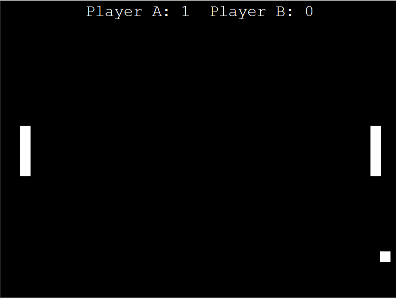

# pong-game

#### For Player A:

	To move paddle up press 'w'
	To move paddle down press 's'

### For Player B:

	To move paddle up press 'UP_ARROW'
	To move paddle down press 'DOWN_ARROW'

# freeCodeCamp
https://www.youtube.com/watch?v=XGf2GcyHPhc
